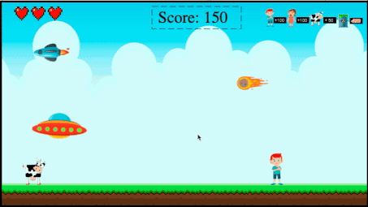

## The Abduction Game

Project #1 - Web Development - IRONHACK

## Introduction

You are UFO pilot passing through a little planet called Earth.

Your objective is to accumulate points by abducting the beings that appear on your way, while avoiding obstacles that damage your ship and can destroy you.

## Features

- Sua espaçonave possui uma poderosa luz que pode ser usada para abduzir o que ela atingir. A luz só pode ser usada an altitude correta de abdução, a nave muda de aparencia e acende suas luzes, indicando que o sistema de abdução está pronto para ser usado

- Cada impacto remove uma vida, representada por um coração. Ao zerar o número de vidas, o jogo acaba

- This planet has diverse beings and each one provides a different score when abducted. The inhabitants of the planet also produce dangerous things, be careful when abducting them, as they lower your score.

- A velocidade e a quantidade de obstáculos aumentam com o tempo de jogo
- Periodicamente o seres não abduzidos somem para dar espaço a novos
- A nave emite um som indicando quando algo for abduzido
- A tela inicial possui um botão com todas as instruções do jogo, em inglês e portugues.

## GamePlay

- As setas do teclado movimentam a nave :arrow_up: :arrow_down: :arrow_left: :arrow_right:

- A tecla Espaço ativa a luz de abdução

## Live Game

To play the game, click on the link: http://hugomiranda.me/Abduction-Game/

## Upcoming Features

- Sistema de evolução do jogador
- Sistema de escolha de jogador
